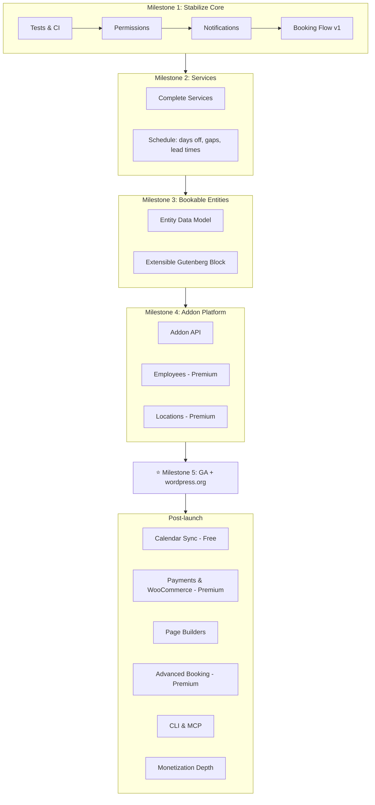

# WP Appointments – Development Roadmap

> Updated: 2026-03-15 (based on founder meeting and Must Have discussions analysis)

## Current state

- **Product model:** Free core (open-source) + paid addons (premium repo: `wpappointments-premium` submodule).
- **Core (free):** Appointments, Schedules, Customers, Settings, basic Notifications; REST API (Appointments, Availability, Customers, Settings, **Services**); CPTs: `wpa-appointment`, `wpa-schedule`, `wpa-service`. Capabilities are filterable for extensions.
- **Existing:** 3 CPTs, 5 REST controllers (~15 routes), 4 capabilities, email notifications with template variables, React admin (Dashboard, Calendar, Customers, Services, Settings, Wizard), Gutenberg booking block (single/multi-step), 15 PHP tests + Playwright E2E, TypeScript frontend with React Hook Form + Valibot.
- **Missing:** WP-CLI, addon manager, service variants CPT (defined but not registered), shortcode builder, advanced scheduling (gaps, lead times, holidays), calendar sync, payments.
- **Links:** [Milestones](https://github.com/wpappointments/wpappointments/milestones), [Project Board](https://github.com/orgs/wpappointments/projects/6), [Must Have Discussions](https://github.com/wpappointments/wpappointments/discussions?discussions_q=is%3Aopen+label%3A%22%5Bidea%5D+Must+have%22)

---

## Key business decisions (2026-03-15)

| Feature | Free / Premium | Rationale |
|---------|---------------|-----------|
| Calendar sync (Gmail, Outlook, CalDAV) | **Free** | cal.com offers this free; competitive necessity |
| Webhooks | **Free** | Charging for webhooks is unacceptable |
| CLI & MCP server | **Free** | Core extensibility tool |
| Payments & WooCommerce | **Premium** | "If you make money, you pay us" |
| Employees | **Premium** | First premium addon |
| Locations | **Premium** | First premium addon |
| Custom fields, advanced features | **Premium** | Revenue drivers |
| Pricing model | Single tier ~$99/year | All premium addons included (WooCommerce-like model) |

**Lesson from WPDesk/Flexible Shipping:** Don't give too much for free — it's hard to monetize later.

---

## Milestone 1: Stabilize Free Core

> [GitHub Milestone](https://github.com/wpappointments/wpappointments/milestone/4)

### Epic: Testing & Quality Assurance (#283)

| # | Task | Status |
|---|------|--------|
| 1 | Set up GitHub Actions CI pipeline (PHP lint, PHPUnit, JS build, ESLint) | |
| 2 | Add PHPUnit tests for all REST endpoint controllers (Appointments, Availability, Customers, Services, Settings) | |
| 3 | Add PHPUnit tests for all model classes (Appointment, Customer, Service, Settings) | |
| 4 | Add PHPUnit tests for all query classes (AppointmentsQuery, CustomersQuery, ServicesQuery) | |
| 5 | Add Playwright E2E tests for complete booking flow (single-step + multi-step) | |
| 6 | Add Playwright E2E tests for admin CRUD operations (appointments, services, customers) | |
| 7 | Add Jest unit tests for key React components (BookingFlow, AppointmentForm, TimeFinder) | |
| 8 | Set up code coverage reporting and minimum threshold | |

### Epic: Permission System (#285)

| # | Task | Status |
|---|------|--------|
| 1 | Audit and document all existing capabilities (`wpa_manage_appointments`, `wpa_manage_settings`, `wpa_manage_services`, `wpa_manage_customers`) | |
| 2 | Add granular capabilities: `wpa_view_appointments`, `wpa_create_appointments`, `wpa_edit_appointments`, `wpa_delete_appointments` (same pattern for services, customers) | |
| 3 | Add capability checks to all REST endpoint permission callbacks | |
| 4 | Create role management admin UI (which roles get which capabilities) | |
| 5 | Ensure `wpappointments_capabilities` filter works for addon capability extension | |
| 6 | Add tests for permission checks on all endpoints | |

### Epic: Email Notifications (#287)

| # | Task | Status |
|---|------|--------|
| 1 | ~~Basic email notifications for appointment lifecycle~~ | Done |
| 2 | ~~Per-event notification settings (enable/disable, admin/customer recipients)~~ | Done |
| 3 | Add customizable HTML email template editor in admin settings | |
| 4 | Add more template variables: `{service_name}`, `{service_duration}`, `{customer_email}`, `{customer_phone}`, `{site_name}`, `{site_url}`, `{manage_url}` | |
| 5 | Add email preview/test send functionality | |
| 6 | Add notification for "no show" event | |

### Epic: Booking Flow v1 (#290)

| # | Task | Status |
|---|------|--------|
| 1 | ~~Basic booking flow (calendar, time selection, customer form, confirmation)~~ | Done |
| 2 | ~~Single-step and multi-step flow modes~~ | Done |
| 3 | Service selection step integration (select service → show available times) | |
| 4 | Improve mobile responsive layout | |
| 5 | Add loading states and error handling for all API calls | |
| 6 | Add success confirmation page with appointment summary | |
| 7 | Guest checkout vs logged-in user flow | |
| 8 | Accessibility audit (ARIA, keyboard navigation, screen reader) | |

**Outcome:** Solid, test-covered free core; clear free vs paid scope.

---

## Milestone 2: Services & Booking Foundations

> [GitHub Milestone](https://github.com/wpappointments/wpappointments/milestone/5)

### Epic: Complete Services (#295)

| # | Task | Status |
|---|------|--------|
| 1 | ~~Services REST API (CRUD endpoints)~~ | Done |
| 2 | ~~Services admin list UI~~ | Done |
| 3 | ~~Services in onboarding wizard~~ | Done |
| 4 | Active/inactive toggle with filtering | |
| 5 | Service duration configuration (variable durations) | |
| 6 | Service pricing (basic price field, display in booking flow) | |
| 7 | Service categories/grouping | |
| 8 | Service image/icon support | |
| 9 | Service description display in booking flow | |
| 10 | Register and implement `wpa-service-variant` CPT (already defined in PluginInfo) | |

### Epic: Schedule Improvements (#299)

| # | Task | Status |
|---|------|--------|
| 1 | Days off / holidays configuration (recurring + one-off) | |
| 2 | Gaps (breaks) between appointments - global and per-service (#95) | |
| 3 | Minimum reservation lead time - don't allow booking too close (#94) | |
| 4 | Maximum reservation lead time - don't allow booking too far ahead (#94) | |
| 5 | Buffer before/after appointments (preparation + cleanup time) | |
| 6 | Schedule exceptions (one-off availability overrides) | |
| 7 | Multiple schedule support (different schedules for different contexts) | |
| 8 | Admin calendar improvements: week view, day view (currently month-only) | |

**Outcome:** Services fully usable in free plugin. Gaps, lead times, days off, holidays working.

---

## Milestone 3: Bookable Entities & Data Model

> [GitHub Milestone](https://github.com/wpappointments/wpappointments/milestone/6)

**This is THE most important feature.** Bookable entities are the core abstraction enabling all use cases: time slots, rooms, tables, parking spots, lockers, hotel rooms, yoga classes, etc. (#89)

### Epic: Bookable Entities Data Model (#282)

| # | Task | Status |
|---|------|--------|
| 1 | Design entity schema: CPT `wpa-bookable-entity` with meta for type, properties, capacity | |
| 2 | Entity CRUD REST API endpoints | |
| 3 | Entity-Service relationships (which services can be booked on which entity) | |
| 4 | Entity availability/schedule (own opening hours, overrides) | |
| 5 | Entity properties system (custom attributes: location, capacity, type, etc.) | |
| 6 | Nested entities support (e.g. restaurant → tables, marina → parking spots → boat slips) | |
| 7 | Entity query builder with filtering (by type, location, availability) | |
| 8 | Migration path from current flat appointment model to entity-based | |
| 9 | Entity admin UI (list, create, edit, assign services) | |
| 10 | Entity selection in booking flow (choose entity → choose time) | |
| 11 | Min/max participants per entity slot (group bookings foundation) (#95 related) | |

### Epic: Extensible Gutenberg Block (#284)

| # | Task | Status |
|---|------|--------|
| 1 | Refactor existing block to use filter/hook system for attributes and panels | |
| 2 | Add `wpappointments_block_attributes` filter for addon block attributes | |
| 3 | Add `wpappointments_block_inspector_panels` filter for addon settings panels | |
| 4 | Add `wpappointments_block_render` filter for addon render modifications | |
| 5 | Service selector in block inspector (pick which services to show) | |
| 6 | Entity selector in block inspector (pick which entities to show) | |
| 7 | Shortcode `[wpappointments]` as alternative to Gutenberg block | |
| 8 | Widget registration for classic themes / sidebars | |

**Outcome:** Flexible data model that supports any booking use case. Gutenberg block extensible by addons.

---

## Milestone 4: Addon Platform & First Premium Addons

> [GitHub Milestone](https://github.com/wpappointments/wpappointments/milestone/7)

### Epic: Addon Registration Platform (#286) — `wpappointments/wpappointments` (core)

| # | Task | Status |
|---|------|--------|
| 1 | Design addon registry API (`wpappointments_register_addon()` function) | |
| 2 | Addon loader: scan and load registered addons on plugin init | |
| 3 | Addon activation/deactivation hooks with database migration support | |
| 4 | Addon version compatibility checking (require min core version) | |
| 5 | Admin UI: Addons page listing installed/available addons with status | |
| 6 | Addon settings API (register addon settings, display in admin) | |
| 7 | REST API extension points (addons register own endpoints under `wpappointments/v1/`) | |
| 8 | Gutenberg block extension points (addons add inspector panels, attributes) | |
| 9 | Notification extension points (addons register custom events/templates) | |
| 10 | License validation system for premium addons | |

### Epic: Extension - Employees (#288) — `wpappointments/wpappointments-premium`

| # | Task | Status |
|---|------|--------|
| 1 | Employee model (linked to WordPress user with limited capabilities) | |
| 2 | Employee REST API (CRUD, assignment) | |
| 3 | Employee admin UI (list, create, edit, manage schedule) | |
| 4 | Employee schedule management (own working hours, days off, vacation, one-off availability) | |
| 5 | Employee-service assignment (which services each employee offers) | |
| 6 | Employee-location assignment (which locations each employee works at) | |
| 7 | Employee-entity assignment (assign employees to bookable entities) | |
| 8 | Employee selection in booking flow (choose employee → show their availability) | |
| 9 | Employee calendar view in admin (per-employee appointment list) | |
| 10 | Employee webhook triggers (#56 integration) | |
| 11 | Manual employee assignment for admins (#101) | |

### Epic: Extension - Locations (#293) — `wpappointments/wpappointments-premium`

| # | Task | Status |
|---|------|--------|
| 1 | Location model (CPT with address, coordinates, timezone) | |
| 2 | Location REST API (CRUD) | |
| 3 | Location admin UI (list, create, edit) | |
| 4 | Location default opening hours (own schedule) | |
| 5 | Location-employee assignment (which employees work here) | |
| 6 | Location-service assignment (which services this location offers) | |
| 7 | Location-entity assignment (which bookable entities belong here) | |
| 8 | Location selection in booking flow (choose location first) | |
| 9 | Location webhook triggers (#56 integration) | |

**Outcome:** Clear free vs paid boundary. Addon API defined. Employees and Locations as first premium addons ready for sale.

---

## Milestone 5: GA Release & wordpress.org Submission ⭐

> [GitHub Milestone](https://github.com/wpappointments/wpappointments/milestone/8)

### Epic: GA Release & wordpress.org Submission (#298)

| # | Task | Status |
|---|------|--------|
| 1 | Plugin review compliance: sanitization, escaping, nonces on all forms | |
| 2 | Create `readme.txt` for wordpress.org (description, FAQ, screenshots, changelog) | |
| 3 | Prepare plugin assets (banner, icon, screenshots) for wordpress.org | |
| 4 | Full i18n audit: all user-facing strings wrapped in `__()` / `_e()` / `esc_html__()` | |
| 5 | Generate `.pot` file, set up translation workflow | |
| 6 | Security audit: OWASP top 10, SQL injection, XSS, CSRF checks | |
| 7 | Performance audit: database queries, asset loading, caching | |
| 8 | User documentation: getting started guide, FAQ, addon installation | |
| 9 | Developer documentation: hooks reference, REST API docs, addon development guide | |
| 10 | Submit to wordpress.org plugin review team | |
| 11 | Set up update mechanism for premium addons (license-gated updates) | |

**This is the critical moment.** Submit to wordpress.org free plugin repo. At least Employees + Locations premium addons ready for sale.

---

## Milestone 6: Calendar Sync (Free)

> [GitHub Milestone](https://github.com/wpappointments/wpappointments/milestone/9)

### Epic: 2-way Calendar Sync (#289)

| # | Task | Status |
|---|------|--------|
| 1 | CalDAV library integration (sabre/dav or similar) | |
| 2 | Google Calendar OAuth2 connect flow | |
| 3 | Office 365 / Outlook OAuth2 connect flow (#50) | |
| 4 | Generic CalDAV connect (any CalDAV server) (#51) | |
| 5 | 2-way sync engine: local→remote (new appointments create calendar events) | |
| 6 | 2-way sync engine: remote→local (calendar events block availability) | |
| 7 | Multi-calendar support (connect multiple calendars per user) | |
| 8 | Per-calendar settings: block availability (on/off), add events (on/off), target calendar | |
| 9 | Sync conflict resolution (what happens when both sides change) | |
| 10 | Background sync via wp_cron (periodic polling) | |
| 11 | Admin UI: connected calendars list, connect/disconnect, settings | |
| 12 | Per-employee calendar connection (when Employees addon active) | |

**Outcome:** Gmail, Outlook, CalDAV — all free. 2-way sync with multi-calendar support.

---

## Milestone 7: Payments & WooCommerce (Premium)

> [GitHub Milestone](https://github.com/wpappointments/wpappointments/milestone/10)

### Epic: Payments & WooCommerce Integration (#291) — `wpappointments/wpappointments-premium`

| # | Task | Status |
|---|------|--------|
| 1 | WooCommerce detection and integration bootstrap | |
| 2 | Auto-create WC product when service is created (with price, duration as attributes) | |
| 3 | Booking → WC Order creation (appointment = line item in order) | |
| 4 | WC checkout flow integration (redirect to WC checkout after booking) | |
| 5 | Payment confirmation → appointment confirmation (WC order status hooks) | |
| 6 | Refund handling (WC refund → appointment cancellation) | |
| 7 | Basic Stripe integration (standalone, for users without WooCommerce) | |
| 8 | Coupon codes integration with WooCommerce coupons (#98) | |
| 9 | Admin: payment status display on appointment details | |
| 10 | Booking flow: price display, payment method selection | |

**Outcome:** WooCommerce integration solves all payment gateways. Standalone Stripe for simpler setups.

---

## Milestone 8: Page Builder Integrations

> [GitHub Milestone](https://github.com/wpappointments/wpappointments/milestone/11)

### Epic: Page Builder Integrations (#292)

| # | Task | Status |
|---|------|--------|
| 1 | Elementor widget: booking calendar with all block options | |
| 2 | Bricks Builder element: booking calendar | |
| 3 | Divi module: booking calendar (#74) | |
| 4 | Extended Gutenberg blocks: service list, employee list, location selector | |
| 5 | Classic shortcode enhancements: attributes for service, entity, location filtering | |

**Outcome:** Booking calendar embeddable in all major page builders.

---

## Milestone 9: Advanced Booking Features (Premium)

> [GitHub Milestone](https://github.com/wpappointments/wpappointments/milestone/12)

### Epic: Events & Group Bookings (#294) — `wpappointments/wpappointments-premium`

| # | Task | Status |
|---|------|--------|
| 1 | Event entity type (recurring events: yoga class, workshop, etc.) | |
| 2 | Min/max participants per event slot | |
| 3 | Group booking flow (multiple people book same slot) | |
| 4 | Waitlist when event is full (#discussion) | |
| 5 | Waitlist notifications (notify all when spot opens, first-come-first-served) | |
| 6 | Event calendar view (public-facing event list) | |

### Epic: Advanced Booking Features (#296) — `wpappointments/wpappointments-premium`

| # | Task | Status |
|---|------|--------|
| 1 | Custom fields for appointments, customers, services, employees, locations (#75) | |
| 2 | Cart feature: book multiple services/slots in one checkout (#100) | |
| 3 | Predefined booking flows (pre-fill service, date, time — generate shareable link) | |
| 4 | Send-to-customer link (admin creates slot, sends link, customer fills info + pays) | |
| 5 | Gift cards: purchase gift card → redeem for booking (#78) | |
| 6 | Multi-day appointments (booking spanning multiple days) | |
| 7 | Recurring appointments (e.g. weekly session with same client) | |

**Outcome:** Full-featured booking system covering all Must Have discussions.

---

## Milestone 10: CLI, MCP & Automation

> [GitHub Milestone](https://github.com/wpappointments/wpappointments/milestone/13)

### Epic: CLI, MCP Server & Automation (#297)

| # | Task | Status |
|---|------|--------|
| 1 | WP-CLI base: `wp wpa` command group registration | |
| 2 | CLI: `wp wpa appointment list/create/update/cancel/delete` | |
| 3 | CLI: `wp wpa service list/create/update/delete` | |
| 4 | CLI: `wp wpa customer list/create/update/delete` | |
| 5 | CLI: `wp wpa schedule list/update` | |
| 6 | CLI: `wp wpa settings get/set` | |
| 7 | CLI extensibility: `wpappointments_cli_commands` filter for addon commands | |
| 8 | Webhooks: outgoing webhooks for all entity events (#56) | |
| 9 | Webhooks: incoming webhook handler (external systems → create appointment) | |
| 10 | Webhooks admin UI: manage endpoints, test, view logs | |
| 11 | MCP server: expose booking operations as MCP tools | |
| 12 | Zapier/Make.com integration (triggers + actions) | |
| 13 | ElevenLabs voice booking integration (agentic control) | |

**Outcome:** Full automation stack. Each addon extends CLI with its own commands via hooks.

---

## Milestone 11: Monetization Depth

> [GitHub Milestone](https://github.com/wpappointments/wpappointments/milestone/14)

### Epic: Monetization & Advanced Premium (#300) — `wpappointments/wpappointments-premium`

| # | Task | Status |
|---|------|--------|
| 1 | Variable pricing module: formula builder, pricing tables (#102) | |
| 2 | Bulk discounts: discount on multiple services or longer bookings (#99) | |
| 3 | Invoicing: auto-generate invoices for paid appointments | |
| 4 | Credit system: prepaid credits for appointments | |
| 5 | Agency addon: white label, limit client addon access, custom branding | |
| 6 | Multisite support (#103) | |
| 7 | Analytics dashboard: bookings, revenue, popular services, peak hours | |
| 8 | SMS notifications via Twilio/SMSapi | |
| 9 | Traffic light system: visual availability indicator on calendar (#64) | |

---

## Diagram

## Free vs Premium summary

### Free core (`wpappointments/wpappointments`)
- Appointments, Schedules, Services, Customers
- Bookable entities (core data model)
- Booking flow (Gutenberg block + shortcode + widget)
- Email notifications (customizable templates)
- Calendar sync (Gmail, Outlook, CalDAV) — post-launch
- Webhooks — post-launch
- CLI & MCP server — post-launch
- Addon registration platform
- Basic analytics

### Premium (`wpappointments/wpappointments-premium`, ~$99/year, all addons)
- Employees (staff management, assignment, own schedules)
- Locations (multi-location, own hours)
- Payments & WooCommerce integration
- Custom fields (appointments, customers, services, employees, locations)
- Events & group bookings (min/max participants, waitlist)
- Multi-day appointments, recurring appointments
- Cart & predefined booking flows
- Gift cards, coupon codes, bulk discounts
- Variable pricing, invoicing, credit system
- Page builder integrations (Elementor, Bricks, Divi)
- Agency addon, white label
- Zapier, Make.com integrations
- SMS notifications (Twilio/SMSapi)
- Advanced analytics
