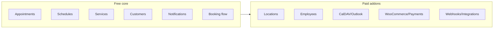

# WP Appointments – Long-term development plan

## Current state

- **Product model:** Free core (open-source) + paid addons (premium repo: `wpappointments-premium` submodule).
- **Core (free):** Appointments, Schedules, Customers, Settings, basic Notifications; REST API (Appointments, Availability, Customers, Settings, **Services**); CPTs: `wpa-appointment`, `wpa-schedule`, `wpa-service`. Capabilities are filterable for extensions.
- **Gaps** (welcome panel): admin calendar month-only, limited Gutenberg block, no shortcode builder, non-editable emails, simple opening hours only, no stats/reports. Extension features (Locations, Employees, sync) planned as addons.
- **Links:** [Issues](https://github.com/wpappointments/wpappointments/issues?q=is%3Aissue+is%3Aopen), [Discussions](https://github.com/wpappointments/wpappointments/discussions).

---

## Phase 1 – Stabilize free core

- Tests: Playwright setup + first test (#267); tests for Queries, Utils, Core, Plugin (#265, #266).
- Robust permission system (#262).
- Notifications: simple email notifications (#42); option to customise template, edit email contents, email settings (#44).
- Booking flow v1 (#45) and Epic free version (#39) clearly defined.

**Outcome:** Solid, test-covered free core; clear free vs paid scope.

---

## Phase 2 – Complete Services in core (free)

- Services: REST completeness (#248), Admin list UI (#249), active/inactive (#252), better wizard (#256).
- Shortcode builder and/or more Gutenberg block options.
- Schedule: days off, holidays; edge cases beyond simple opening hours.

**Outcome:** Services fully usable in free plugin; welcome/docs updated.

---

## Phase 3 – Addon platform and first paid addons

- Addon API: how premium plugins register (hooks, `wpappointments_capabilities`, optional addon registry in core). Core stays dependency-free from premium.
- Premium repo: first addons — **Locations**, **Employees** (assign appointments to staff; manual assignment option).
- Docs: what is free, what is premium, how to install addons.

**Outcome:** Clear free vs paid boundary; Locations and/or Employees as paid addons.

---

## Phase 4 – Calendar sync and integrations (paid / mixed)

- Sync addons: 2-way CalDAV, 2-way Office 365 Outlook (premium).
- Integrations (by demand): Webhooks, WooCommerce, Polish payment gateways; optionally Tidio, Platformly, Blocksy, Gutenberg expansion.
- Status UX (e.g. traffic light) if it fits.

**Outcome:** Sync and main integrations as addons or documented integration points.

---

## Phase 5 – Monetisation and product depth

- Revenue addons: Invoicing, Coupon codes, Cart, Bulk discounts, Variable pricing. Decide premium vs core-with-limits.
- Advanced: Multisite, multiple employees per appointment, simultaneous services, Ajax where it helps UX.
- Analytics: stats/reports — free basic vs premium detailed.

**Outcome:** Clear premium feature set and pricing; roadmap for further addons.

---

## Next steps (order)

1. Complete Services (#248, #249, #252, #256).
2. Email notifications (#42, #44) and booking flow v1 (#45).
3. Tests (#265–#267) and permission system (#262).
4. Update welcome panel and docs to current free feature set.
5. Addon registration in core; first premium addon (Locations or Employees).
6. Prioritise Discussions (Webhooks, WooCommerce, CalDAV/Outlook, Polish payments) and implement.

---

## Diagram (high level)

