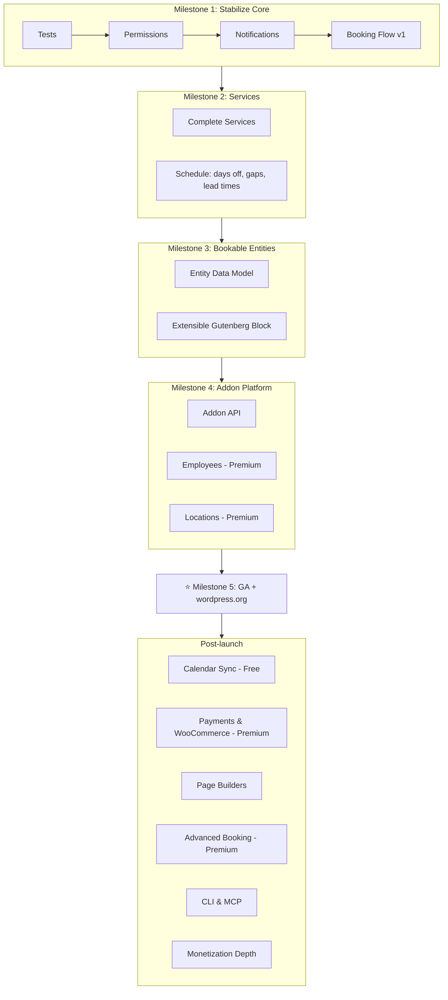

# WP Appointments – Development Roadmap

> Updated: 2026-03-15 (based on founder meeting and Must Have discussions analysis)

## Current state

- **Product model:** Free core (open-source) + paid addons (premium repo: `wpappointments-premium` submodule).
- **Core (free):** Appointments, Schedules, Customers, Settings, basic Notifications; REST API (Appointments, Availability, Customers, Settings, **Services**); CPTs: `wpa-appointment`, `wpa-schedule`, `wpa-service`. Capabilities are filterable for extensions.
- **Gaps:** admin calendar month-only, limited Gutenberg block, no shortcode builder, non-editable emails, simple opening hours only, no stats/reports. Extension features (Locations, Employees, sync) planned as addons.
- **Links:** [Milestones](https://github.com/wpappointments/wpappointments/milestones), [Project Board](https://github.com/orgs/wpappointments/projects/6), [Must Have Discussions](https://github.com/wpappointments/wpappointments/discussions?discussions_q=is%3Aopen+label%3A%22%5Bidea%5D+Must+have%22)

---

## Key business decisions (2026-03-15)

| Feature | Free / Premium | Rationale |
|---------|---------------|-----------|
| Calendar sync (Gmail, Outlook, CalDAV) | **Free** | cal.com offers this free; competitive necessity |
| Webhooks | **Free** | Charging for webhooks is unacceptable |
| CLI & MCP server | **Free** | Core extensibility tool |
| Payments & WooCommerce | **Premium** | "If you make money, you pay us" |
| Employees | **Premium** | First premium addon |
| Locations | **Premium** | First premium addon |
| Custom fields, advanced features | **Premium** | Revenue drivers |
| Pricing model | Single tier ~$99/year | All premium addons included (WooCommerce-like model) |

**Lesson from WPDesk/Flexible Shipping:** Don't give too much for free — it's hard to monetize later.

---

## Milestone 1: Stabilize Free Core

> [GitHub Milestone](https://github.com/wpappointments/wpappointments/milestone/4)

| Epic | Issue |
|------|-------|
| Testing & Quality Assurance | #283 |
| Permission System | #285 |
| Email Notifications | #287 |
| Booking Flow v1 | #290 |

**Outcome:** Solid, test-covered free core; clear free vs paid scope.

---

## Milestone 2: Services & Booking Foundations

> [GitHub Milestone](https://github.com/wpappointments/wpappointments/milestone/5)

| Epic | Issue |
|------|-------|
| Complete Services | #295 |
| Schedule Improvements | #299 |

**Outcome:** Services fully usable in free plugin. Gaps, lead times, days off, holidays working.

---

## Milestone 3: Bookable Entities & Data Model

> [GitHub Milestone](https://github.com/wpappointments/wpappointments/milestone/6)

| Epic | Issue |
|------|-------|
| Bookable Entities Data Model | #282 |
| Extensible Gutenberg Block | #284 |

**This is THE most important feature.** Bookable entities are the core abstraction enabling all use cases: time slots, rooms, tables, parking spots, lockers, hotel rooms, yoga classes, etc. Every addon builds on this foundation.

**Outcome:** Flexible data model that supports any booking use case. Gutenberg block extensible by addons.

---

## Milestone 4: Addon Platform & First Premium Addons

> [GitHub Milestone](https://github.com/wpappointments/wpappointments/milestone/7)

| Epic | Issue |
|------|-------|
| Addon Registration Platform | #286 |
| Extension: Employees (Premium) | #288 |
| Extension: Locations (Premium) | #293 |

**Outcome:** Clear free vs paid boundary. Addon API defined. Employees and Locations as first premium addons ready for sale.

---

## Milestone 5: GA Release & wordpress.org Submission ⭐

> [GitHub Milestone](https://github.com/wpappointments/wpappointments/milestone/8)

| Epic | Issue |
|------|-------|
| GA Release & wordpress.org Submission | #298 |

**This is the critical moment.** Submit to wordpress.org free plugin repo. Free core fully functional:
- Booking flow, services, bookable entities, notifications, Gutenberg block
- Tests, permissions, documentation
- At least Employees + Locations premium addons ready for sale

**Everything after this point is post-launch.**

---

## Milestone 6: Calendar Sync (Free)

> [GitHub Milestone](https://github.com/wpappointments/wpappointments/milestone/9)

| Epic | Issue |
|------|-------|
| 2-way Calendar Sync | #289 |

Gmail, Outlook, CalDAV — all **free**. 2-way sync with multi-calendar support.

---

## Milestone 7: Payments & WooCommerce (Premium)

> [GitHub Milestone](https://github.com/wpappointments/wpappointments/milestone/10)

| Epic | Issue |
|------|-------|
| Payments & WooCommerce Integration | #291 |

WooCommerce integration solves all payment gateways: services become WC products, bookings become WC orders. Stripe, PayU, Przelewy24 — all via WooCommerce.

---

## Milestone 8: Page Builder Integrations

> [GitHub Milestone](https://github.com/wpappointments/wpappointments/milestone/11)

| Epic | Issue |
|------|-------|
| Page Builder Integrations | #292 |

Elementor, Bricks Builder, Divi, extended Gutenberg blocks.

---

## Milestone 9: Advanced Booking Features (Premium)

> [GitHub Milestone](https://github.com/wpappointments/wpappointments/milestone/12)

| Epic | Issue |
|------|-------|
| Events & Group Bookings | #294 |
| Advanced Booking Features | #296 |

Multiday, waitlist, custom fields, cart, predefined booking flows, send-to-customer links.

---

## Milestone 10: CLI, MCP & Automation

> [GitHub Milestone](https://github.com/wpappointments/wpappointments/milestone/13)

| Epic | Issue |
|------|-------|
| CLI, MCP Server & Automation | #297 |

WP-CLI + MCP server (extensible by addons). Webhooks (free). Zapier/Make.com. ElevenLabs voice booking.

Each addon extends the CLI with its own commands via hooks — same pattern as UI extensions.

---

## Milestone 11: Monetization Depth

> [GitHub Milestone](https://github.com/wpappointments/wpappointments/milestone/14)

| Epic | Issue |
|------|-------|
| Monetization & Advanced Premium | #300 |

Variable pricing, invoicing, credit system, agency addon, whitelabel, multisite, analytics.

---

## Diagram

## Free vs Premium summary

### Free core
- Appointments, Schedules, Services, Customers
- Booking flow (Gutenberg block + shortcode)
- Bookable entities (core data model)
- Email notifications (customizable templates)
- Calendar sync (Gmail, Outlook, CalDAV)
- Webhooks
- CLI & MCP server
- Basic analytics

### Premium (~$99/year, all addons)
- Employees (staff management, assignment)
- Locations (multi-location)
- Payments & WooCommerce
- Custom fields
- Events & group bookings
- Multiday appointments
- Waitlist
- Cart & predefined booking flows
- Coupon codes, bulk discounts, gift cards
- Variable pricing, invoicing, credit system
- Page builder integrations (Elementor, Bricks, Divi)
- Agency addon, whitelabel
- Zapier, Make.com integrations
- Advanced analytics
